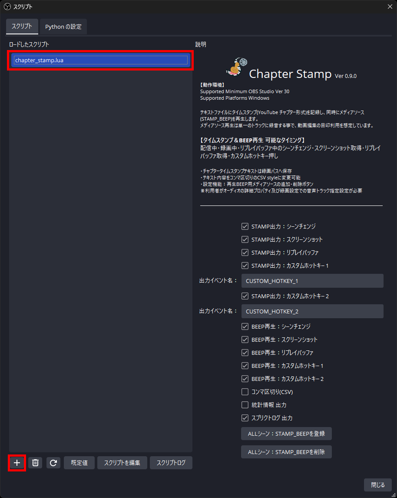
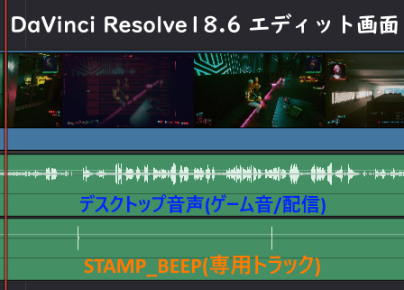
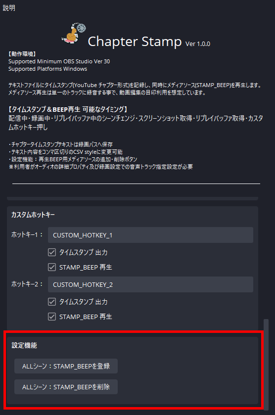
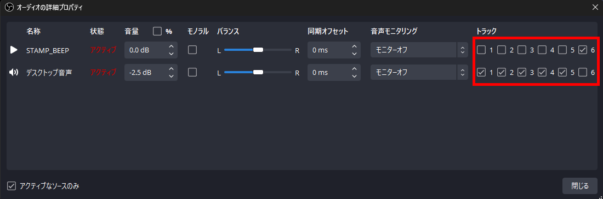
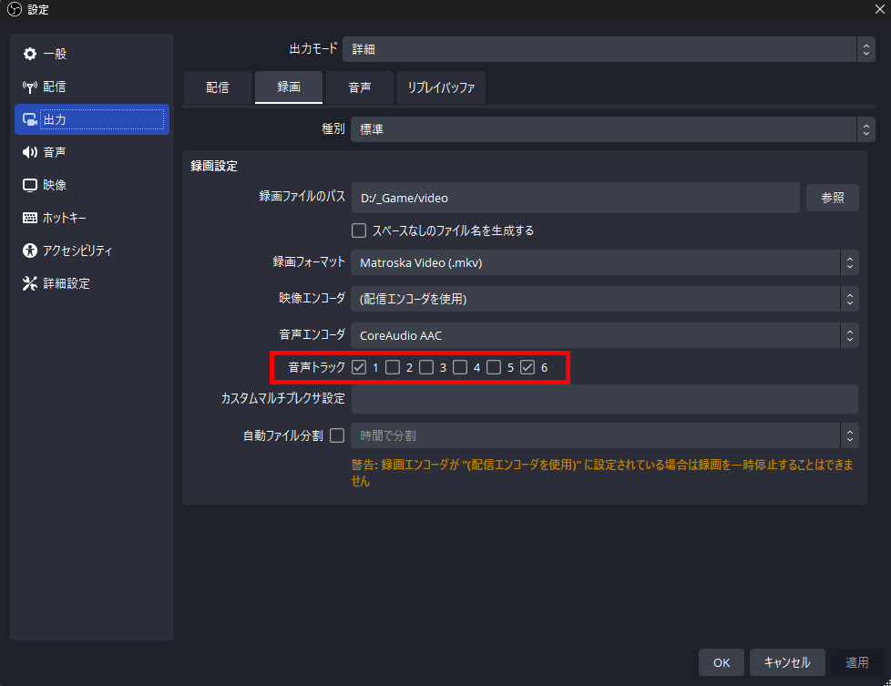
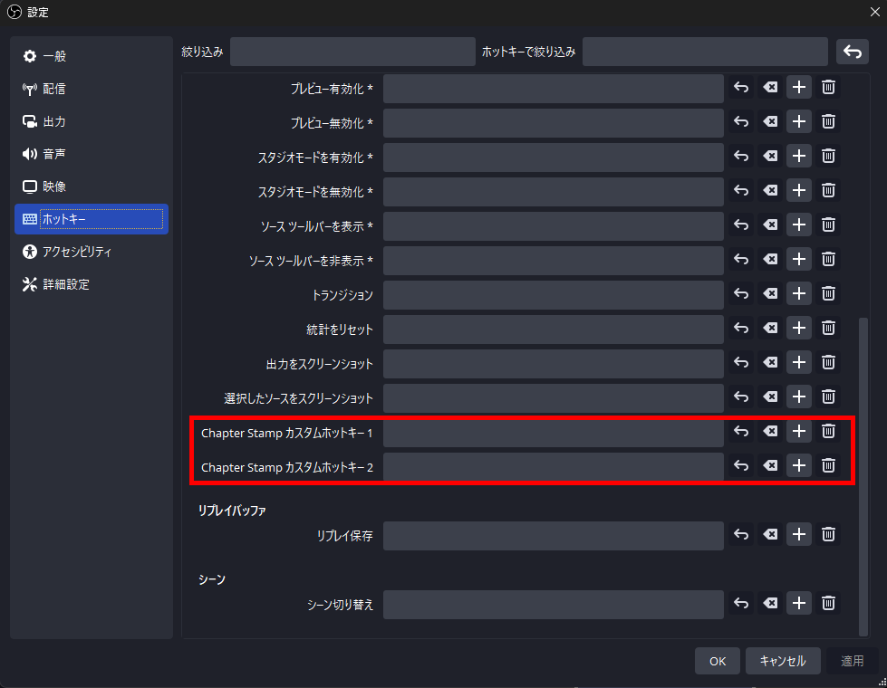
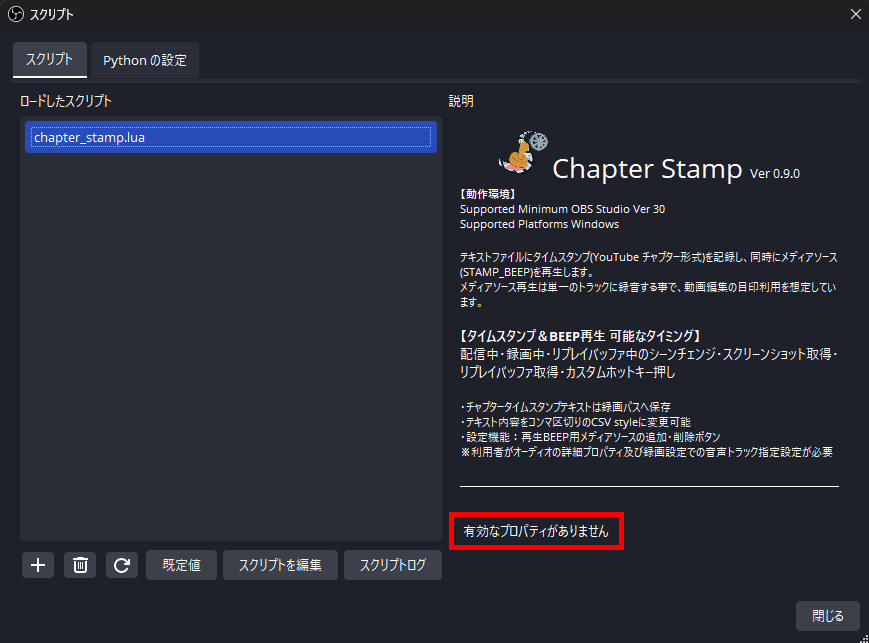
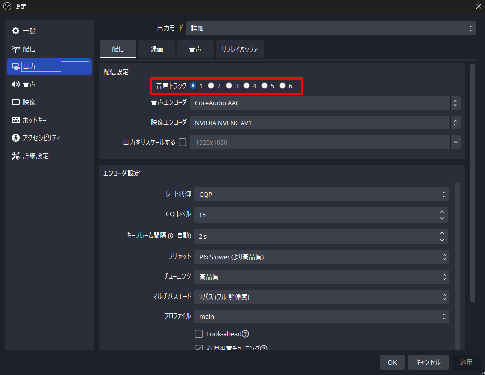

# Chapter Stamp (OBS-script-ChapterStamp)

## Chapter Stampについて
テキストファイルにタイムスタンプ(YouTube チャプター形式)を記録し、同時にメディアソース(STAMP_BEEP)を再生します。  
メディアソース再生は単一のトラックに録音する事で、動画編集の目印利用を想定しています。  

### 動作環境
- Supported Minimum OBS Studio Ver 30
- Supported Platforms Windows[^1]

> [!WARNING]  
> OBS Studio 29以降に導入されたAPIを利用利用しています。Ver 30.0.0未満では動作しないようになっています。  

> [^1]: Windows以外のプラットフォームは動作未確認のため非対応としています。 専用な実装はしていないので動作する可能性はあります。  

### 開発・確認環境
- Windows11(22H2)
- OBS Studio 30.0.2

## インストール
1. 『***chapter_stamp.lua***』及び『***STAMP_BEEP.wav***』の2つのファイルを、OBS Studioインストールしたパス[^2]の下にある
   『***./data/obs-plugins/frontend-tools/scripts***』のパスへコピーして下さい。  
2. OBS Studio メニューバーの『ツール』から『スクリプト』を選び、スクリプトウィンドウを表示して、
   ウィンドウ下部にある『**＋**』追加ボタンで、1.でコピーした『***chapter_stamp.lua***』ファイルを追加して下さい。  
3. ロードしたスクリプトリストで『***chapter_stamp.lua***』を選択した状態で、スクリプトウィンドウ右に説明と
   設定項目が表示されればインストール作業は完了です。  [^3]
4. インストール作業とは別にメディアソース(STAMP_BEEP)の導入、及び各部のトラック設定が必要です。  
   下記、[**STAMP_BEEP登録・及び音声トラックの設定方法**](#stamp_beep%E7%99%BB%E9%8C%B2%E5%8F%8A%E3%81%B3%E9%9F%B3%E5%A3%B0%E3%83%88%E3%83%A9%E3%83%83%E3%82%AF%E3%81%AE%E8%A8%AD%E5%AE%9A%E6%96%B9%E6%B3%95)を参照して下さい。

  > [^2]: OBS Studioインストールパスは、利用プラットフォームや提供形態により変化します。  
  > [^3]: 『***有効なプロパティがありません***』と表示された場合は、FAQを参照して下さい。  

</br>

## 詳細

- 配信・録画・リプレイバッファのいずれかの最初の開始が『00:00:00』としてタイムスタンプ記録し始めます。  
  また配信・録画・リプレイバッファのいずれかの最後の終了でタイムスタンプ記録を終了します。  

- タイムスタンプとSATMP_BEEPの再生が可能なタイミングは配信中/録画中/リプレイバッファ中の
  シーンチェンジ・スクリーンショット取得・リプレイバッファ取得・カスタムホットキーを押した時になります。  

- タイムスタンプのファイルはOBS Studioの設定 録画パスに格納されます。  
  ファイル名は書式設定で『年/月/日/時/分/秒』の部分のみ取得開始時間に置き換えて、接尾語で**Chapter_Stamp.txt**を付与します。  
  書式設定の初期設定値では上書きされる事はありませんが、変更れている場合は『年/月/日/時/分/秒』以外の書式は無視されますので、
  生成ファイル名が重ならないよう、区別できる書式設定に変更して下さい。  

  ```
  OBS Studio 初期設定値時のファイル名形式：2024-01-01 17-05-59 Chapter_Stamp.txt
  ```

 > [!IMPORTANT]  
 > 表示精度と内部実装の関係で、タイムスタンプやファイル名で1秒ほど誤差が出る場合があります。  
 > 配信では通信状況などの遅延が出た場合もライブアーカイブとタイムスタンプの時間にズレが発生します。  

- メディアソース(STAMP_BEEP)を単一のトラックに録音する事で、マルチトラック対応の動画編集ソフトを利用で
  BEEP音トラックの波形を編集ポイントの目印に利用出来ます。[^4][^5]  

  > [^4]:  連続再生可能なタイミングなどはメディアソース再生の仕様に準拠し、再生中に再生イベントが発生しても再生されません。  
  > [^5]: タイムスタンプとメディアソース再生はズレがほぼ有りませんが、イベント時と再生にはズレ生じますのであくまで目安となります。  

  </br>

 > [!WARNING]  
 > 利用者がオーディオの詳細プロパティ及びOBS Studio設定の『出力』項目『録画』タブで音声トラックの設定が必須になります。  

### STAMP_BEEP登録・及び音声トラックの設定方法

   0. シーン及びソースに変更を加えますので、元に戻す事が出来るように必ず設定の実行前にプロファイルや
      シーンコレクションのバックアップは取得して下さい。  
      『***chapter_stamp.lua***』と同じスクリプトパスに『***STAMP_BEEP.wav***』が存在する事が前提になります。  
      必ずファイルが存在する事を確認してください。  
      スクリプトパスはOBS Studioをインストールしたパス[^2]の以下の
      『***./data/obs-plugins/frontend-tools/scripts***』場所になります。  

   1. 全てのシーンで既に『***STAMP_BEEP***』という名前のソースがある場合は別名に変更して下さい。  

  > [!WARNING]  
  > 変更せずに次ぎの2.の登録作業を行ってしまうと、既存のSTAMP_BEEPを全シーンへ登録してしまいます。  
  > 元に戻すには手動で不要なシーンから削除するか、バックアップからの復旧になります。  

  </br>

   2. スクリプト設定の下部にある、『ALLシーン：STAMP_BEEPを登録』ボタンを押すことでローカルファイルで
      『***STAMP_BEEP.wav***』を参照し『***ソースがアクティブになったときに再生を再開する***』をオフにした、
      『***STAMP_BEEP***』という名前のメディアソースを１つ登録します。  
      同時に全てのシーンに対してソースのリストの最下部にロック状態で『***既存を追加***』する形で登録されます。  
      ソースが登録される事で音声ミキサーにも『***STAMP_BEEP***』が表示され、出力先のトラックが全てオフな為に
      スピーカーマーク横に『**！**』マークが表示されます。  
      『ALLシーン：STAMP_BEEPを削除』ボタンを押すことで、全てのシーンにあるメディアソース『***STAMP_BEEP***』を削除します。  

  </br>

   3. 音声ミキサーに表示された『***STAMP_BEEP***』からオーディオの詳細プロパティ設定を開き、
      トラック項目で単一で利用するトラック番号にチェックを付けて有効にしてください。  
      『***STAMP_BEEP***』以外の『***デスクトップ音声***』などは、逆に『***STAMP_BEEP***』で有効にした
      トラック番号のチェックを外して無効にしてください。  

   - 例：トラック６を単一利用する場合

        | ■有効 □無効|トラック|
        |---|---|
        |デスクトップ音声   |１■２■３■４■５■６□|
        |STAMP_BEEP         |１□２□３□４□５□６■|

  </br>

   4. OBS Studioの設定ウィンドウを開き、『出力』項目の『録画』タブにある音声トラックで、
      前の３で『***STAMP_BEEP***』で有効にしたトラック番号にチェックして有効にしてください。  

   - 例：トラック６を単一利用する場合

        |■有効 □無効  | トラック|
        |---|---|
        |音声トラック   |１■２□３□４□５□６■|

  </br>

  > [!NOTE]  
  > 上記の０～４を設定する事で、録画動画にデスクトップ音声とSTAMP_BEEPの音が別々オーディオトラックとして
  > 記録する事ができます。  

  > [!WARNING]  
  > 上記の３・４の設定で既に複数のトラックを利用運用している場合は、それに合わせた設定を行ってください。  

  - カスタムホットキーはOBS Studioの設定ウィンドウ『ホットキー』項目で『***Chapter Stamp カスタム
      ホットキー(数字)***』へ、任意のキーコマンドを登録する事で利用出来ます。  
     - ホットキー自体の利用方法はOBS Studioに準拠します。  
     - ホットキー操作でのシーンチェンジ・スクリーンショット取得・リプレイバッファ取得でも
       タイムスタンプ取得とメディアソース(STAMP_BEEP)再生は行われます。  
     - Chapter Stamp設定項目にある各ホットキーの出力イベント名は、テキストに保存されるイベント名です。  
       任意の文字列を入力可能ですが、利用可能文字はOBS Studioに準拠します。
       CSVの項目区切りであるコンマ『**,**』を利用すると項目がズレてしまうので避けて下さい。  

  </br>

  - テキストへのタイムスタンプ出力及びSTAMP_BEEP音を再生をイベント毎にオン・オフしたい場合は
    Chapter Stamp設定の各項目の『タイムスタンプ出力』/『STAMP_BEEP 再生』の設定を変更してください。  
    チェックが付いてる場合が有効、チェックが無い場合が無効となります。  

  - Chapter Stamp設定のその他にある『コンマ区切り(CSV)』を変更する事で、生成テキストファイル内容の
    出力項目をコンマ区切り(CSVスタイル)かスペース区切りに切り換えする事が出来ます。  
    チェックが付いてる場合がコンマ区切り、チェックが無い場合がスペース区切りになります。  
    初期設定はスペース区切りの設定です。  

  > [!NOTE]  
  > コンマ区切り(CSV)にする事で、生成テキストを表計算ソフトなどCSV対応ソフトを利用することで
  > 項目を分けて扱う事ができます。  

  - Chapter Stamp設定の『統計情報 出力』を変更する事で、配信・録画・リプレイバッファを終了したタイミングで、  
    生成テキストファイルの下部に、OBS Studio APIで取得できる一部の統計情報が追記されます。  
    ただし、出力項目がタイムスタンプの行とフォーマットが異なりますので、カンマ区切り(CSV)利用の時はご注意下さい。  

  > [!IMPORTANT]  
  > 提供APIでデータを収拾していますが、収拾タイミングやデータ処理方法がOBS Studioとは別なため、
  > OBS Studioの統計ドックに表示される数値とは異なり、目安の値としてご利用下さい。  
  > 各ビットレートは出力データ合計からの概算で、正確な数値ではありません。  
  > **一定間隔でデータのサンプリングのため処理負荷やメモリの使用量が増加しますので、
  > PC使用率には余裕がある状態でご利用下さい。**  

  - Chapter Stamp設定の『スクリプトログ 出力』を変更することで、Chapter Stampのログを
    スクリプトログウィンドウへの出力の有無を変更する事が出来ます。  
    チェックが付いてる場合が有効、チェックが無い場合が無効となります。  
    不都合な無ければ初期設定の出力状態で問題ありません。

  - Chapter Stamp設定の『アジャスター(sec)』を変更する事で、調整用タイムスタンプ及び調整用URL Queryパラメータの
    秒数を変更する事が出来ます。  
    初期値は **0秒** で、その場合は通常タイムスタンプと同じ内容が出力されます。  
    調整可能な範囲は ***-60～60(秒)*** の間で、設定値を通常タイムスタンプの時間に対して加算処理します。
    事前に設定しておく項目になり、システム的にライブ配信で一定時間ズレ事が解っている場合にアジャスターを設定して
    調整したタイムスタンプを出力させるために利用します。  
    例えば通常タイムスタンプ時間よりライブアーカイブの時間が5秒遅い場合は、5秒のズレを削りたいので-5を設定します。  

  > [!IMPORTANT]  
  > 調整用URL QueryパラメータはYouTubeの仕様でマイナス値が存在しないので、マイナス値の場合は全て **0秒** として処理します。  
  > 調整値を-5秒とした場合に、調整用タイムスタンプは **-00:00:05** からカウントが始まりますが、調整用URL Queryパラメータは
  > 調整用タイムスタンプがマイナス値の間はずっと **&t=0** を出力します。

### ***利用の注意点***  

  - OBS Studio設定の『詳細設定』項目の『遅延配信』及び『録画』項目の『自動ファイル分割』に
    非対応な為、利用した場合に不具合が発生する場合があります。  
  - 録画の一時停止には非対応な為、利用してしまうとタイムスタンプと録画データ内容の位置が
    ズレてしまいます。一時停止の利用を避けるか、手動にてタイムスタンプを修正してください。  
  - 配信中・録画中・リプレイバッファ中に、chapter_stamp.luaを追加した場合や再ロードボタン・
    規定値ボタンを押したり、各種項目の設定値を変更した場合は正常に動作しません。  
    またchapter_stamp.lua動作中(配信中・録画中・プレイバッファ中)にスクリプトを削除・
    再ロードボタン・規定値ボタンした場合も正常に動作しません。  
    ***必ず、何も行っていない状態でchapter_stamp.luaを追加(ロード・規定値)及び設定を行ってから、
    配信・録画・リプレイバッファを開始するようにしてください。***  


### タイムスタンプ 出力フォーマット

  > [!IMPORTANT]  
  > - 『コンマ区切り(CSV)』設定を有効にすると各項目の間のみ『,』コンマ区切りします。  
  > - 『統計情報 出力』設定を有効にするとAbout Stats Informationを終了時にタイムスタンプテキストの下部に出力します。
  > - アジャスターで調整する調整用タイムスタンプ及び調整用URL Queryパラメータは常に出力されます。

- 【タイムスタンプ】
  - 1行目は出力項目のタイトルを出力します。(スペース区切り)    
  ```
  1:interval_alert 2:Timestamp 3:URLQueryParameter 4:Scene_name 5:Event_name 6:Filename 7:Adjust_stamp 8:Adjust_URL
  ```
  - 出力例
  ```
  スペース   ：@ 00:06:18 &t=378 シーン SCREENSHOT Screenshot 2024-01-27 12-43-41.png 00:06:14 &t=374
  コンマ(CSV)：,00:06:53,&t=413,シーン 2,SCENE_CHANGE,,00:06:49,&t=409
  ```
    |例|アラート|タイムスタンプ|URL Queryパラメータ|フロントエンドシーン|イベント名|ファイル名|調整タイムスタンプ|調整URL|
    |---|---|---|---|---|---|---|---|---|
    ||1:interval_alert|2:Timestamp|3:URLQueryParameter|4:Scene_name|5:Event_name|6:Filename|7:Adjust_stamp|8:Adjust_URL|
    |通常|@|00:06:18|&t=378|シーン|SCREENSHOT|Screenshot 2024-01-27 12-43-41.png|00:06:14|&t=374|
    |CSV|(出力無し),|00:06:53,|&t=413,|シーン 2,|SCENE_CHANGE,|(出力無し),|00:06:49,|&t=409|

    - 第１項目はYouTube制限の前タイムスタンプとの間隔が10秒未満の場合に『@』マークが入ります。  
    - 第２項目はYoutubeチャップター形式のタイムスタンプを表記します。  
    - 第３項目はYouTube URL最後尾に追加すると該当シーンが再生開始に出来る、時間指定のクエリパラメータを表記します。  
    - 第４項目はイベント時のフロントエンド(カレント)表示しているシーン名を表記します。  
      **内容を把握しやすくする為に、シーン名は変更をする事をオススメします。**  
    - 第５項目はスタンプを発生させたイベント名です。イベント表記は下記にあります。  
    - 第６項目は録画開始・スクリーンショット取得・リプレイバッファ取得のイベントのみ、取得ファイル名を表記します。  
      **※タイムスタンプとファイル名の時間にズレが発生する場合があります。**  
    - 第７項目はアジャスターで調整したタイムスタンプを表記します。  
    - 第８項目はアジャスターで調整した時間指定のクエリパラメータを表記します。


- イベント表記、BEEP再生
    |操作|イベント名|STAMP_BEEP再生|ファイル名出力|
    |---|---|---|---|
    |配信開始           |  -- STREAMING START --       |なし|なし|
    |配信停止           |  -- STREAMING STOP --        |なし|なし|
    |録画開始           |  -- RECORDING START --       |なし|有り|
    |録画停止           |  -- RECORDING STOP --        |なし|なし|
    |リプレイバッファ開始|  -- REPLAY BUFFER START --   |なし|なし|
    |リプレイバッファ停止|  -- REPLAY BUFFER STOP --    |なし|なし|
    |リプレイバッファ取得|  REPLAY BUFFER               |有り|有り|
    |シーンチェンジ      |  SCENE_CHANGE                |有り|なし|
    |スクリーンショット  |  SCREENSHOT                  |有り|有り|
    |カスタムホットキー  |  CUSTOM_HOTKEY_1~2           |有り|なし|

- About 統計情報 出力例(コンマ区切り(CSV))
    |出力|概要|
    |---|---|
    |1,About Stats Information:,2024-01-27 12:44:54    |採取終了時間|
    |2,Sampling Count:,900                             |サンプリング回数|
    |3,Total Output Data(NotFileSize)(Mbytes):,355.69  |出力データの合計|
    |4,Average bitrate(kbps):,6475                     |平均ビットレート|
    |5,Maximum bitrate(kbps):,11978                    |最高ビットレート|
    |6,Minimum bitrate(kbps):,1334                     |最低ビットレート|
    |7,Network Dropped frames:,0                       |ネットワーク輻輳ドロップフレーム数|
    |8,Total frames:,26821                             |合計出力フレーム数|
    |9,Dropped frame rate(%):,0.00                     |ドロップフレームの割合|


## FAQ
  - Ｑ、『***chapter_stamp.lua***』をロードしても、『***有効なプロパティがありません***』と表示されてしまう。  
    - スクリプトログに『[chapter_stamp.lua] WARNING:Chapter Stamp Lua script STOP!!!, 
      this OBS Studio version is not supported.』と出力されている場合は、メッセージの内容通りに
      ご利用のOBS Studioのバージョンがサポート外の為です。  
      Chapter Stampの動作環境に記載された対応バージョンのOBS Studioをご利用をお願い致します。  
      安易にご利用バージョンを変更されますと、ご利用環境のシステムやOBS Studioに導入済みの  
      プラグイン及びスクリプトが正常に動作しない可能性もありますので、ご注意下さい。  

    </br>

  - Ｑ、ファイル名やタイムスタンプの時間、またはSTAMP_BEEP音が少しズレてしまう。  
    - 申し訳ありません、OBS StudioのLuaスクリプトの仕様で非同期で動作する関係で、
      どうしても1秒程度のズレに関しては仕様になります。  
      ご利用PCの性能及び使用状況で負荷が高い場合は遅延が発生しやすくなりますので、OBS Studioの
      処理が滞らないようにPCの負荷を下げて使用率に余裕を持たせてご利用ください。  

  - Ｑ、Youtubeライブ アーカイブとタイムスタンプの時間がズレてしまう。  
    - どうしても利用環境による処理遅延などがあり、仕様で必ずズレてしまいます。  
      遅延が一定時間の場合は、アジャスター機能を利用して下さい。  
      遅延量の確認は事前に行いアジャスター値を設定するようにして下さい。  
      複数で調整されたタイムスタンプを利用したい場合はエクセルなどの表計算ソフトを利用して
      一定の加算処理などを行って取得するようにして下さい。  
      ※タイムスタンプ項目を計算するには表計算ソフトのTIME関数を利用すると計算しやすくなります。  

  - Ｑ、配信やスピーカー/イヤホンなどから『***STAMP_BEEP***』の音が鳴ってしまう。  
    - オーディオの詳細プロパティで、『***STAMP_BEEP***』の音声モニタリング項目をモニターオフに、
      トラック項目でデスクトップ音声などの他のソースと『***STAMP_BEEP***』は重ならないよう
      排他的論理和(XOR)の形になるように設定してください。  
      またOBS Studioの設定ウィンドウ『出力』項目の『配信』タブの有効な音声トラック設定の
      番号とオーディオの詳細プロパティの『***STAMP_BEEP***』のトラック番号が重なると配信に
      出力されますので、別のトラック番号を設定してください。

    </br>

  - Ｑ、録画データに『***STAMP_BEEP***』の音が入ってない。  
    - オーディオの詳細プロパティで、『***STAMP_BEEP***』のトラックで有効にした番号を
      OBS Studioの設定ウィンドウ『出力』項目の『配信』タブの音声トラックでも同じ番号を
      有効に設定してください。  
      オーディオの詳細プロパティで、『***STAMP_BEEP***』の音声モニタリング項目をモニターオフに
      設定してください。

  - Ｑ、『***STAMP_BEEP.wav***』を変更したい、再生される音を変更したい。  
    - 『***STAMP_BEEP.wav***』はメディアソースで再生出来る別ファイルを置き換える事で、
      違う音に変更可能ですし、STAMP_BEEPメディアソースを登録後にプロパティ設定変更で指定
      ファイルを変更する事でも可能です。  
      次ぎのFAQに関連しますが『***STAMP_BEEP***』で再生音は、ある程度の音量があり再生時間が
      短い音が適しています。

  - Ｑ、STAMP_BEEPの音が連続して鳴らない。  
    - メディアソースを利用して再生している関係で連続で再生できない場合があります。
      OBS Studioの仕様となってしまいますので、再生時間が短いファイルを利用するなどして
      出来るだけ連続再生とならないように、利用をお願い致します。  
      またタイムスタンプが１秒精度で、１秒内の連続イベント利用を想定しておりません。

  - Ｑ、もっとカスタムホットキーを増やしたい。  
    - カスタムホットキーはスクリプトを編集する事で最大5個に増やす事が可能です。  
      増やすには設定値を必初期化する要があるため、事前にChapter_Stampスプリクトの設定値、
      及びOBS Studio設定の『ホットキー』項目内の『Chapter Stampカスタムホットキー』に設定した
      キーコマンドをメモなどに書き写してバックアップして下さい。  
      ***※ホットキーの数を変更する場合は必ず設定を規定値ロードを行って下さい。***  

      **【ホットキーを増やす手順】**

      1. Chapter_Stampの設定値及びホットキーのキーコマンドをメモしてバックアップを行う。  
      2. スクリプトウィンドウで『***chapter_stamp.lua***』を選択した状態で、
         ウィンドウ下部にある規定値ボタンを押して設定値を初期化。  
      3. スクリプトパスの中にある『***chapter_stamp.lua***』をエディタで開き、コード内
         『***stamp_flg.chotkey_max_number = 2***』と記載されている、数字を『5』(半角数字)に
         変更しファイルを保存した後、スクリプト設定ウインドウ『***chapter_stamp.lua***』を選択した
         状態で下部にある再ロードボタンと規定値ボタンを順番に押して再読み込み実施。  
      4. スクリプトの設定項目が増えている事を確認して、メモした設定を再設定。  
      5. 念のためSTAMP_BEEPメディアソース及びオーディオの詳細プロパティや録画設定の音声
         トラックの設定など他の設定値に変更がないかもご確認下さい。  

         ***※OBS Studio側の上限が不明な為に安全の為にChapter Stampでは最大５個までとしています。  
           それ以上の個数を利用したい場合は自己責任でプログラムコードを改変して下さい。***

  - Ｑ、一部のシーンに対して表示チェンジのみタイムスタンプを取得したい。  
    - 指定シーンのみのアクションを設定及び取得する事はプログラムコードや利用方法が
      複雑化してしまうため対応が困難です。  
      申し訳ありませんが、出力されたテキストファイルをエディタ等で該当シーン名をキーワード
      検索機能などで抽出するようにしてご利用下さい。  

  - Ｑ、英語など他の言語バージョンがほしい。 及び、商用利用したい。
    - MITライセンスにて公開しておりますので、forkして他言語版など作って頂けたと思います。  
      ただし、コード中にあるアイコンデータは [いらすとや.](https://www.irasutoya.com/)から画像を引用して制作しておりますので、  
      アイコンの著作権はいらすとや様所有されていますので、アイコン利用は利用規定に従って下さい。  
      従わない場合はコード内の既存アイコンデータ削除し、他のデータに差し換えなど行って下さい。  

  - Ｑ、カスタムホットキー毎に別の音を鳴らしたい
    - スクリプト上では利用が複雑化してしまう為、対応が難しいく申し訳ありません。
      カスタムホットキー同じキーコマンドを別のメディアソースの再開再生に登録する事で、
      連動動作する事で可能ですので、下記に手動での設定方法を記載します。

      **【ホットキー別に音を変更する手順】**

      1. 鳴らしたい音ごとにメディアソースを区別のつく名前で１個づつ追加する。  
         メディアソースのプロパティで『***ソースがアクティブになったときに再生を再開する***』をオフに設定して下さい。  
      2. 鳴らしたいシーンごとに１.で追加したメディアソースを『***既存を追加***』する形で登録する。  
      3. 音声ミキサーに表示された追加したメディアソースのオーディオの詳細プロパティ設定を開き、
         トラックで『***STAMP_BEEP***』と同じ番号のみにチェックを付けて有効にして下さい。  
      4. OBS Studioの『設定』『ホットキー』にメディアソース毎に項目が増えてますので、
         その中の『再開』に対して、組み合わせて利用したいカスタムホットキーと同じキーコマンドを登録して下さい。  
      5. 『***STAMP_BEEP***』の再生音が鳴らないように、Chapter Stamp設定で該当の『STAMP_BEEP 再生』を無効にして下さい。  

      同様の方法でシーンチェンジ・スクリーンショット取得・リプレイバッファ取得も、同様にメディアソースと同じキーコマンドを
      登録する事で、別の音を鳴らす事が出来ます。


