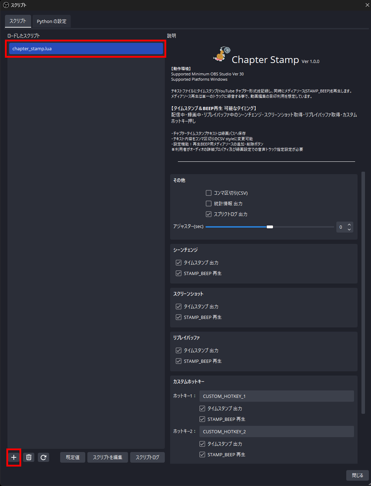
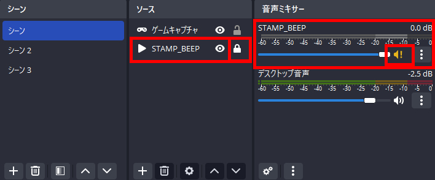
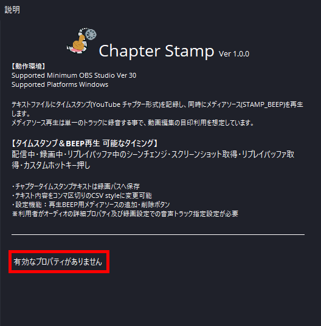

# Chapter Stamp (OBS-script-ChapterStamp)

## Chapter Stampについて
テキストファイルにタイムスタンプ(YouTube チャプター形式)を記録し、同時にメディアソース(STAMP_BEEP)を再生します。  
メディアソース再生は単一のトラックに録音する事で、動画編集の目印利用を想定しています。  

### 動作環境
- Supported Minimum OBS Studio Ver 30
- Supported Platforms Windows[^1]

> [!WARNING]
> OBS Studio 29以降に導入されたAPIを利用しているため、29より前のバージョンでは動作しません。  

> [^1]: Windows以外のプラットフォームは動作未確認のため非対応としています。 専用な実装はしていないので動作する可能性はあります。  

### 開発・確認環境
- Windows11(22H2)
- OBS Studio 30.0.2

## インストール
1. 『chapter_stamp.lua』及び『STAMP_BEEP.wav』の2つのファイルを、OBS Studioインストールしたパス[^2]の下にある
   『./data/obs-plugins/frontend-tools/scripts』のパスへコピーして下さい。  
2. OBS Studio メニューバー『ツール』から『スクリプト』を選んで、スクリプトウィンドウを表示して、
   ウィンドウ下部にある『＋』ボタンで、１でコピーした『chapter_stamp.lua』を追加して下さい。  
3. ロードしたスクリプトリストで『chapter_stamp.lua』を選択して、スクリプトウィンドウ右に説明、
   及び設定項目が表示されればインストール完了です。  
4. インストール作業とは別にメディアソース(STAMP_BEEP)の導入、及び各部のトラック設定が必要です。  
   下記、STAMP_BEEP登録・及び音声トラックの設定方法を参照して下さい。

> [^2]: OBS Studioインストールパスは、利用プラットフォームや提供形態により変化します。  

 

## 詳細

- タイムスタンプ＆BEEP再生が可能なタイミングは配信中/録画/リプレイバッファ中のシーンチェンジ・
  スクリーンショット取得・リプレイバッファ取得・カスタムホットキーを押した時になります。  

- 配信・録画・リプレイバッファのいずれかでタイムスタンプ記録を開始し、OBS設定の録画パスにOBS Studioの
  ファイル名書式設定に準拠した年/月/日/時/分/秒の部分のみにChapter_Stamp.txtを追加したファイル名でテキストファイルを生成します。  
  初期設定値では上書きされる事はありませんが変更れている場合は、年/月/日/時/分/秒 以外の書式は全て削除されますので
  生成テキストのファイル名が重ならないように、区別できる書式設定にして下さい。  
  

> [!IMPORTANT]
> 表示精度と内部実装の関係で、タイムスタンプやファイル名で1秒ほど誤差が出る場合があります。  
> 配信では通信状況などの遅延が出た場合、タイムスタンプとライブアーカイブにズレが発生します。  

- メディアソース(STAMP_BEEP)を単一のトラックに録音する事で、マルチトラック対応の動画編集ソフトを利用する事で
  BEEP音トラックの波形を編集ポイントの目印に利用出来ます。  

> [!WARNING]
> 利用者がオーディオの詳細プロパティ及びOBS Studio設定の『出力』項目『録画』タブで音声トラックの設定が必須になります。  

### STAMP_BEEP登録・及び音声トラックの設定方法

   0. シーン及びソースに変更を加えますので、元に戻す事が出来るように必ず設定の実行前にプロファイルや
      シーンコレクションのバックアップを取得して下さい。  
      chapter_stamp.luaと同じスクリプトフォルダにSTAMP_BEEP.wavが存在する事が前提になりますので、
      ファイルがある事を確認してください。  
      スクリプトパスはOBS Studioをインストールしたパス[^2]の以下の
      『./data/obs-plugins/frontend-tools/scripts』の パスです。  

   1. 全てのシーンで既に『STAMP_BEEP』という名前のソースがある場合は別名に変更して下さい。  

> [!WARNING]
> 変更せずに次ぎの2.の登録作業を行ってしまうと、既存のSTAMP_BEEPを全シーンへ登録してしまいます。  
> 元に戻すには手動で不要なシーンから削除するか、バックアップからの復旧になります。  

   2. スクリプト設定の下部にある、『ALLシーン：STAMP_BEEPを登録』ボタンを押すことでローカルファイルで
      STAMP_BEEP.wavを参照し『ソースがアクティブになったときに再生を再開する』をオフにした、
      『STAMP_BEEP』という名前のメディアソースを１つ登録します。  
      同時に全てのシーンに対してソースのリストの最下部にロック状態で『既存を追加』する形で登録されます。  
      ソースが登録される事で音声ミキサーにも『STAMP_BEEP』が表示され、出力先のトラックが全てオフな為に
      スピーカーマーク横に『！』マークが表示されます。  

 

   4. 音声ミキサーに表示された『STAMP_BEEP』からオーディオの詳細プロパティ設定を開き、
      トラック項目で単一で利用するトラック番号にチェックを付けて有効にしてください。  
      『STAMP_BEEP』以外の『デスクトップ音声』などは、逆に『STAMP_BEEP』で有効にした
      トラック番号のチェックを外して無効にしてください。  

   - 例：トラック６を単一利用する場合[^11]

        | ■有効 □無効|トラック|
        |---|---|
        |デスクトップ音声   |１■２■３■４■５■６□|
        |STAMP_BEEP         |１□２□３□４□５□６■|

 

   4. OBS Studioの設定ウィンドウを開き、『出力』項目の『録画』タブにある音声トラックで、
      前の３で『STAMP_BEEP』で有効にしたトラック番号にチェックして有効にしてください。  
      **※既に複数のトラックを利用運用している場合は、それに合わせた設定を行ってください。**  

   - 例：トラック６を単一利用する場合[^12]

        |■有効 □無効  | トラック|
        |---|---|
        |音声トラック   |１■２□３□４□５□６■|

 

> [!NOTE]
> 上記の０～４を設定する事で、録画動画にデスクトップ音声とSTAMP_BEEPの音が別々オーディオトラックとして記録する事ができます。  

> [!WARNING]
> ※既に複数のトラックを利用運用している場合は、それに合わせた設定を行ってください。  

  - カスタムホットキーはOBS Studioの設定ウィンドウ『ホットキー』項目で『Chapter Stamp カスタム
      ホットキー数字』へ、任意のキーコマンドを登録する事で利用出来ます。  
      ホットキー自体の利用方法はOBS Studioと同じ違いはありません。  
      またホットキーによる、シーンチェンジ・スクリーンショット取得・リプレイバッファ取得でも
      タイムスタンプ取得とメディアソース(STAMP_BEEP)再生は行われます。  
      Chapter Stamp設定の各ホットキーの出力イベント名は、テキストに保存されるイベント名です。  
      任意の文字列を入力可能ですが、OBSで利用可能な文字のみになりますのでご注意下さい。  
      またCSVファイルで項目の区切りで利用されるコンマ『,』の利用は避けてください。  
      利用してしまうとCSVファイルとして項目がズレてしまいます。  

 

  - テキストへのタイムスタンプ出力及びSTAMP_BEEP音を再生をイベント毎にオン・オフしたい場合は
      Chapter Stamp設定の『STAMP出力：』『BEEP再生：』の各設定を変更してください。  
      チェックが付いてる場合が有効、チェックが無い場合が無効となります。  

  - Chapter Stamp設定の『コンマ区切り(CSV)』を変更する事で、生成テキストファイルの内容で
      項目をコンマ区切り(CSV)かスペース区切りに切り換えする事が出来ます。  
      チェックが付いてる場合がコンマ区切り、チェックが無い場合がスペース区切りになります。  

> [!NOTE]
>       ※コンマ区切り(CSV)にする事で、生成テキストを表計算ソフトなど対応ソフトで利用することで
>       項目を分けて扱う事ができます。  

  - Chapter Stamp設定の『統計情報 出力』を変更する事で、配信・録画・リプレイバッファを
      終了したタイミングで、生成テキストファイルの下部に、OBS Studio APIで取得できる
      一部の統計情報が追記されます。  
      ただし項目出力がタイムスタンプとは異なりますので、カンマ区切り(CSV)利用の時はご注意下さい。  

> [!IMPORTANT]
> 提供APIでデータを収拾していますが、収拾タイミングやデータ処理方法がOBS Studioとは
> 別な為OBS Studioの統計ドックに表示される数値とは異なり、目安の値としてご利用下さい。  
> 各ビットレートは出力データ合計からの概算な為、正確な数値ではありませんのでご注意下さい。  
> 一定間隔でデータのサンプリングを行う為、処理負荷やメモリの使用量が増加しますので、
> PC使用率には余裕がある状態でご利用下さい。**  

  - Chapter Stamp設定の『スクリプトログ 出力』を変更することで、Chapter Stampのログを
      スクリプトログウィンドウへの出力の有無を変更する事が出来ます。  
      チェックが付いてる場合が有効、チェックが無い場合が無効となります。  

### ***利用の注意点***  

  - OBS Studio設定の『詳細設定』項目の『遅延配信』及び『録画』項目の『自動ファイル分割』に
    非対応な為、利用した場合に不具合が発生する場合があります。  
  - 録画の一時停止には非対応な為、利用してしまうとタイムスタンプと録画データ内容の位置が
    ズレてしまいます。利用を避けるか、手動にてタイムスタンプを修正してください。  
  - 配信中・録画中・リプレイバッファ中に、chapter_stamp.luaを追加した場合や再ロードボタン・
    規定値ボタンを押したり、各種項目の設定値を変更した場合は正常に動作しません。  
    またchapter_stamp.lua動作中(配信中・録画中・プレイバッファ中)にスクリプトを削除・
    再ロードボタン・規定値ボタンした場合も正常に動作しません。  

    ***必ず、何も行っていない状態でchapter_stamp.luaを追加(ロード・規定値)及び設定を行ってから、
    配信・録画・リプレイバッファを開始するようにしてください。***  

### タイムスタンプ 出力フォーマット

> [!IMPORTANT]
> 『コンマ区切り(CSV)』設定を有効にすると各項目の間のみ『,』コンマ区切りします。  
> 『統計情報 出力』設定を有効にするとAbout 統計情報を停止時にタイムスタンプテキストの下部に出力します。

- 【タイムスタンプ】
    
    |例|タイムスタンプ|フロントエンドシーン|イベント名|ファイル名|URL Queryパラメータ|
    |---|---|---|---|---|---|
    |通常|\*00:00:07|シーン 3|SCREENSHOT|Screenshot 2024-01-03 23-37-32.png|&t=7|
    |CSV|00:00:38,|シーン 2,|SCENE_CHANGE,|(出力無し),|&t=38|

    - 第１項目は時間をYoutubeチャップター形式のタイムスタンプを表記します、またYouTube
          制限である、前のタイムスタンプとの間隔が10秒未満の場合に先頭には先頭に
          『\*』マークがつきます。  
          ***※『\*』マークは、そのままの利用を未然に防ぐ為にわざと同一項目としています。***  
    - 第２項目は取得時のフロントエンド(カレント)表示しているシーン名を表記します。  
          内容を把握しやすくする為に、シーン名は変更をする事をオススメします。  
    - 第３項目はスタンプを発生させたイベント名です。イベント表記は下記にあります。  
    - 第４項目は録画開始・スクリーンショット取得・リプレイバッファ取得のイベントのみで、
          取得ファイル名を表記します。  
          ***※仕様上の関係で、タイムスタンプとファイル名にズレが発生する場合があります。***  
    - 第５項目はYouTube URL最後尾に追加すると該当シーンが再生開始ポジションになる
          時間指定のクエリパラメータを表記します。  

- イベント表記、BEEP再生

    |操作|イベント名|STAMP_BEEP再生|ファイル名出力|
    |---|---|---|---|
    |配信開始            |  -- STREAMING START --       |なし|なし|
    |配信停止            |  -- STREAMING STOP --        |なし|なし|
    |録画開始            |  -- RECORDING START --       |なし|有り|
    |録画停止            |  -- RECORDING STOP --        |なし|なし|
    |リプレイバッファ開始|  -- REPLAY BUFFER START --   |なし|なし|
    |リプレイバッファ停止|  -- REPLAY BUFFER STOP --    |なし|なし|
    |リプレイバッファ取得|  REPLAY BUFFER               |有り|有り|
    |シーンチェンジ      |  SCENE_CHANGE                |有り|なし|
    |スクリーンショット  |  SCREENSHOT                  |有り|有り|
    |カスタムホットキー  |  CUSTOM_HOTKEY_1~2           |有り|なし|

- About 統計情報 出力例

    |出力|概要|
    |---|---|
    |About Stats Information: 2024-01-03 23:38:14   |採取終了時間|
    |Sampling Count: 98                             |サンプリング回数|
    |Total Output Data(Not FileSize): 39.08 Mbytes  |出力データの合計|
    |Average bitrate: 6533 kbps                     |平均ビットレート|
    |Maximum bitrate: 7084 kbps                     |最高ビットレート|
    |Minimum bitrate: 6582 kbps                     |最低ビットレート|
    |Network Dropped frames: 0                      |ネットワーク輻輳ドロップフレーム数|
    |Total frames: 2884                             |合計出力フレーム数 |
    |Dropped frame rate: 0.00%                      |割合|

## FAQ
  - Ｑ、chapter_stamp.luaをロードしても、『有効なプロパティがありません』と表示されてしまう。  
    - スクリプトログに『[chapter_stamp.lua] WARNING:Chapter Stamp Lua script STOP!!!, 
        this OBS Studio version is not supported.』と出力されている場合は、メッセージの内容通りに
        ご利用のOBS Studioのバージョンがサポート外の為です。  
        Chapter Stampの動作環境に記載された対応バージョンのOBS Studioをご利用をお願い致します。  
        安易にご利用バージョンを変更されますと、ご利用環境のシステムやOBS Studioに導入済みの  
        プラグイン及びスクリプトが正常に動作しない可能性もありますので、ご注意下さい。  

 

  - Ｑ、ファイル名やタイムスタンプの時間、またはSTAMP_BEEP音が少しズレてしまう。  
    - 申し訳ありません、OBS StudioのLuaスクリプトの仕様で非同期で動作する関係で、
        どうしても1秒のズレに関しては仕様になります。  
        また他のズレに関してもこのscript内で改善する事が困難ですので、出来るだけズレが
        発生しない状況でご利用ください。  
        ご利用PCの性能及び使用状況で負荷が高い場合はズレやすくなりますので、OBS Studioの
        処理が滞らないようにPCの負荷を下げて使用率に余裕を持たせてズレが発生しないように
        ご利用ください。  

  - Ｑ、Youtubeライブ アーカイブとタイムスタンプの時間がズレてしまう。  
    - OBS Studio設定の遅延配信などの遅延に関する設定を行っている場合はズレます。  
        またネットワーク状況が不安定な場合やPCの使用率などによって処理が滞ったりした場合も
        同様にズレます。    
        全てのズレに対応が困難な為、申し訳ありませんが、手動にてタイムスタンプを修正対応して
        ご利用ください。    
        ズレが一定の場合は、テキスト内のタイムスタンプ時間部分をスプレッドシートや
        エクセルなどの表計算ソフトを利用して一定の加算処理をするようにして対処してください。  
        ライブアーカイブへは、スタンプの第５項目のクエリパラメータを該当アーカイブの
        URLの最後尾に付加してアクセスする事で該当時間から再生になりますので、
        ズレの確認・タイムスタンプ時間の修正に活用して頂けたらと思います。  

  - Ｑ、配信やスピーカー/イヤホンなどからSTAMP_BEEPの音が鳴ってしまう。  
    - オーディオの詳細プロパティで、『STAMP_BEEP』の音声モニタリング項目をモニターオフに、
        トラック項目でデスクトップ音声などの他のソースと『STAMP_BEEP』は重ならないよう
        排他的論理和(XOR)となるように設定してください。  
        またOBS Studioの設定ウィンドウ『出力』項目の『配信』タブの有効な音声トラック設定の
        番号とオーディオの詳細プロパティの『STAMP_BEEP』のトラック番号が重なると配信に
        出力されますので、別のトラック番号を設定してください。

 

  - Ｑ、録画データにSTAMP_BEEPの音が入ってない。  
    - オーディオの詳細プロパティで、『STAMP_BEEP』のトラックで有効にした番号を
        OBS Studioの設定ウィンドウ『出力』項目の『配信』タブの音声トラックでも同じ番号を
        有効に設定してください。  
        オーディオの詳細プロパティで、『STAMP_BEEP』の音声モニタリング項目をモニターオフに
        設定してください。

  - Ｑ、STAMP_BEEP.wavを変更したい、再生される音を変更したい。  
    - STAMP_BEEP.wavはメディアソースで再生出来る別ファイルを置き換える事で、違う音に変更
        する事が可能です。またSTAMP_BEEPメディアソースを登録後にプロパティ設定変更で指定
        ファイルを変更する事でも可能です。  
        次ぎのFAQに関連しますがSTAMP_BEEPで再生される音は、ある程度の音量があり、再生時間が
        短い音が適しています。

  - Ｑ、STAMP_BEEPの音が連続して鳴らない。  
    - メディアソースを利用して再生している関係で連続で再生できない場合があります。
        OBS Studioの仕様となってしまいますので、再生時間が短いファイルを利用するなどして  
        連続再生とならないように、利用をお願い致します。  

  - Ｑ、もっとカスタムホットキーを増やしたい。  
    - カスタムホットキーはスクリプトを編集する事で最大5個に増やす事が可能です。
        カスタムホットキーを増やすには設定値を必初期化する要があるため、事前にChapter_Stamp
        スプリクトの設定値、及びOBS Studio設定の『ホットキー』項目内の『Chapter Stamp
        カスタムホットキー』に設定したキーコマンドをメモなどに書き写してバックアップして下さい。  
        ※ホットキーの数を変更する場合は必ず設定を規定値ロードを行って下さい  

      **【ホットキーを増やす手順】**

      1. Chapter_Stampの設定値及びホットキーのキーコマンドをメモしてバックアップを行う。  
      2. スクリプトウィンドウでchapter_stamp.luaを選択した状態で、ウィンドウ下部にある
         規定値ボタンを押して設定値を初期化。  
      3. スクリプトパスの中にあるchapter_stamp.luaにコードをエディタで開き、コード内
         『stamp_flg.chotkey_max_number = 2』と記載されている、数字を『5』(半角数字)に
         変更しファイルを保存した後、スクリプト設定ウインドウchapter_stamp.luaを選択した
         状態で下部にある再ロードボタンと規定値ボタンを順番に押して再読み込み実施。  
      4. スクリプトの設定項目が増えている事を確認して、メモした設定を再設定。  
      5. 念のためSTAMP_BEEPメディアソース及びオーディオの詳細プロパティや録画設定の音声
         トラックの設定など他の設定値に変更がないかもご確認下さい。  

         ***※OBS Studio側の上限が不明な為に安全の為にChapter Stampでは最大５個までとしています。  
           それ以上の個数を利用したい場合は自己責任でプログラムコードを改変して下さい。***

  - Ｑ、一部のシーンに対して表示チェンジのみタイムスタンプを取得したい。  
    - 指定シーンのみのアクションを設定及び取得する事はプログラムコードや利用方法が
      複雑化してしまうため対応が困難です。  
      申し訳ありませんが、出力されたテキストファイルをエディタ等で該当シーン名をキーワード
      検索機能などで抽出するようにして下さい。  

  - Ｑ、英語など他の言語バージョンがほしい。 及び、商用利用したい。
    - MITライセンスにて公開しておりますので、forkして他言語版など作って頂けたと思います。  
      ただし、コード中にあるアイコンデータは [いらすとや.](https://www.irasutoya.com/)から画像を引用して制作しておりますので、  
      アイコンの著作権はいらすとや様所有されていますので、アイコン利用は利用規定に従って下さい。  
      従わない場合はコード内の既存アイコンデータ削除し、他のデータに差し換えなど行って下さい。  

